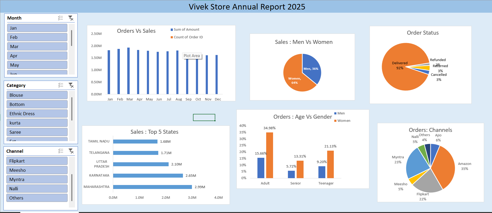

# 🛍️ Vivek Store Annual Sales Analysis (Excel Project)

## 📊 Project Overview

This project is a complete end-to-end sales data analysis of a retail store using Microsoft Excel.

The dataset contains over **30,000 transaction records** including customer details, sales amount, order status, sales channels, demographics, and geographic data.

The objective of this project was to analyze sales performance, customer behavior, and business trends to generate actionable insights.

## 📊 Project Dashboard Preview

---

## 📁 Dataset Details

The main dataset sheet: **"Vivek Store"**

### 🔢 Total Records:
- 31,000+ rows
- 21 columns

### 📌 Columns Included:
- Order ID
- Customer ID
- Gender
- Age
- Age Group
- Order Date
- Month
- Order Status
- Sales Channel
- SKU
- Category
- Size
- Quantity
- Currency
- Amount
- Shipping City
- Shipping State
- Postal Code
- Country
- B2B Indicator

---

## 📊 Worksheets & Analysis Performed

### 1️⃣ Vivek Store Report 2022
Main summary dashboard sheet showing overall annual performance.

---

### 2️⃣ Orders Vs Sales
- Compared total orders with total sales revenue
- Identified monthly trends
- Visualized growth pattern

---

### 3️⃣ Sales - Men Vs Women
- Compared revenue contribution by gender
- Identified which segment generates more revenue

---

### 4️⃣ Order Status
- Analyzed distribution of:
  - Delivered
  - Cancelled
  - Returned
  - Refunded orders
- Helped understand operational efficiency

---

### 5️⃣ Sales - Top 5 States
- Identified highest revenue-generating states
- Helped understand geographic sales performance

---

### 6️⃣ Orders - Age Vs Gender
- Compared age groups with gender segmentation
- Identified target customer segments

---

### 7️⃣ Orders - Channels
- Analyzed sales channels performance
- Compared platforms contributing most revenue

---

### 8️⃣ Insights Sheet
Summarized key business insights derived from analysis.

---

## 🛠 Tools & Techniques Used

- Microsoft Excel
- Pivot Tables
- Pivot Charts
- Data Cleaning
- Sorting & Filtering
- Conditional Formatting
- Dashboard Design
- Business Insight Extraction

---

## 📈 Key Business Insights

- Identified top-performing states contributing maximum revenue
- Analyzed which gender contributes higher sales
- Found most profitable sales channels
- Observed monthly sales trends and seasonality
- Evaluated order cancellation and return impact
- Identified high-performing age groups

---

## 💼 Business Value

This project demonstrates the ability to:

- Handle large datasets (30K+ rows)
- Perform structured business analysis
- Extract actionable insights
- Build Excel dashboards
- Translate raw data into decision-making insights

---

## 🎯 Skills Demonstrated

✔ Data Cleaning  
✔ Data Analysis  
✔ Business Intelligence  
✔ Excel Dashboarding  
✔ Retail Sales Analysis  
✔ Customer Segmentation  
✔ Performance Tracking  

---

## 📌 Conclusion

The analysis provides a complete overview of retail store performance across:

- Demographics
- Geography
- Sales Channels
- Order Behavior
- Revenue Trends

This project showcases practical data analyst skills using Excel in a real-world retail scenario.

---

## 👨‍💻 Author

**Vivek Kumar Kaushal**  
Aspiring Data Analyst  
Skilled in Excel | SQL | Python | Power BI  

---

⭐ If you found this project interesting, feel free to connect or provide feedback.
